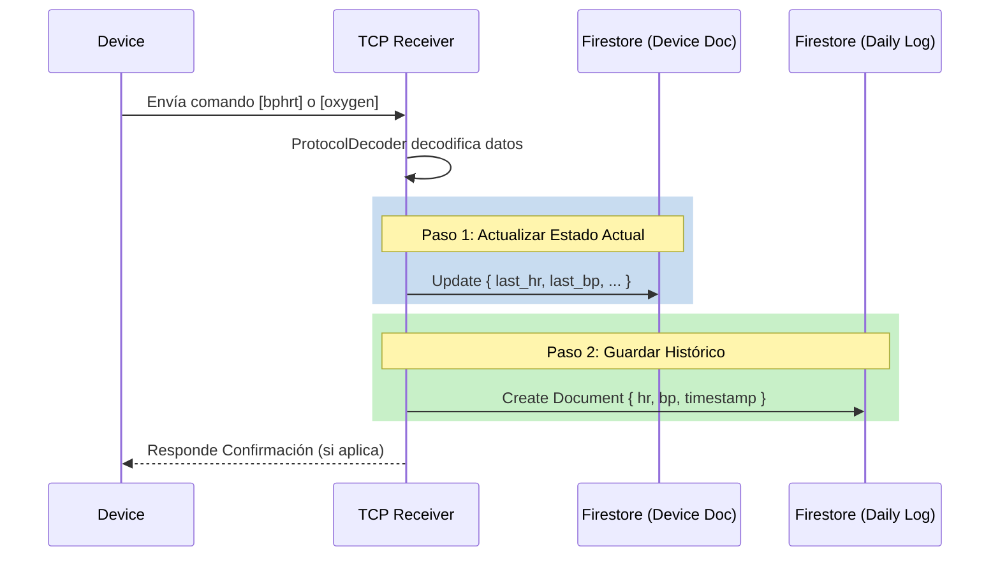

# Flujo de Datos de Salud (Health Data Flow)

Este documento explica cómo el servidor `backend/tcp_receiver.py` procesa, enruta y almacena los datos de salud (Ritmo Cardíaco, Presión Arterial, Oxígeno) enviados por los dispositivos.

## Resumen del Flujo

1.  **Recepción**: El dispositivo envía un comando (`bphrt` o `oxygen`).
2.  **Parsing**: `ProtocolDecoder` extrae los valores numéricos.
3.  **Firestore (Estado Actual)**: Se actualiza el documento del dispositivo con los *últimos* valores conocidos (para mostrar en tarjetas/stickers).
4.  **Firestore (Histórico)**: Se crea un nuevo documento en la subcolección `events` del día correspondiente (para gráficos e historial).

---

## 1. Recepción y Parsing

El servidor escucha en el puerto 5001. Cuando llega un paquete, `handle_client` llama a `ProtocolDecoder.parse_packet(packet_hex)`.

### Comandos Soportados

*   **`bphrt`**: Contiene Presión Arterial y Ritmo Cardíaco.
    *   Método: `_parse_health_data`
    *   Extrae: `bp_systolic`, `bp_diastolic`, `heart_rate`.
*   **`oxygen`**: Contiene Saturación de Oxígeno.
    *   Método: `_parse_spo2_data`
    *   Extrae: `spo2`.

```python
# Ejemplo de parsing en tcp_receiver.py
if parsed.get('type') in ['HEALTH_DATA', 'SPO2_DATA']:
    save_health_data(parsed)
```

---

## 2. Destino de los Datos (Firestore)

La función `save_health_data` (línea 203) maneja la escritura en la base de datos. Los datos se envían a **dos destinos** secuencialmente.

### Destino A: Estado Actual del Dispositivo (Latest State)

Actualiza los campos "last_*" en el documento principal del dispositivo. Esto permite ver el estado más reciente sin buscar en el historial.

*   **Ruta**: `devices/{device_id}`
*   **Campos Actualizados**:
    *   `last_hr`: Último ritmo cardíaco.
    *   `last_bp`: Última presión (formato "sys/dia").
    *   `last_bp_sys`: Última sistólica.
    *   `last_bp_dia`: Última diastólica.
    *   `last_spo2`: Último oxígeno.
    *   `online`: `true`.

### Destino B: Historial de Eventos (Historical Log)

Guarda el evento específico para construir gráficos y registros históricos. Se organiza por días.

*   **Ruta**: `devices/{device_id}/days/{YYYY-MM-DD}/events/{HHMMSS_ffffff}`
*   **Campos**:
    *   `hr`, `bp_sys`, `bp_dia`, `spo2`.
    *   `timestamp`: Fecha y hora del evento.
    *   `source`: Automático o Manual.

---

## 3. Diagrama de Secuencia



## Conclusión

El orden es **estricto**: primero se procesa el paquete, luego se actualiza el estado "en vivo" del dispositivo, y finalmente se guarda el registro histórico. Esto asegura que la interfaz principal siempre muestre el dato más fresco, mientras se asegura la persistencia de todos los datos para análisis futuro.
